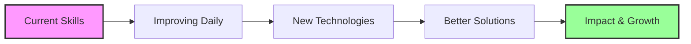

# 🚀 Zerodotone's GitHub Profile

<div align="center">
  
<!-- Animated header -->


<br/>

<!-- Profile views counter -->


</div>

---

## 🎯 About Me

```typescript
const zerodotone = {
    pronouns: "he/him",
    role: "Full Stack Developer",
    motto: "Code with passion, debug with patience",
    currentFocus: "Building scalable web applications",
    funFact: "I debug code faster than I debug my life 😄",
    location: "Vietnam 🇻🇳"
};
```

## 🔥 Current Projects

<table>
<tr>
<td width="50%">

### 📱 Task Management Platform
> **[Taskify.pro.vn](https://taskify.pro.vn/)**

A comprehensive task management solution with real-time collaboration features.

**Tech Stack:**
- Frontend: React, TypeScript, Tailwind CSS
- Backend: Node.js, Express
- Database: MongoDB
- Deployment: Docker, Nginx

</td>
<td width="50%">

### 🚀 Open Source Contributions
> Always looking for meaningful projects to contribute to

Currently exploring:
- Performance optimization tools
- Developer productivity applications
- Cryptocurrency & blockchain projects

**Collaboration Status:** Open for interesting projects! 🤝

</td>
</tr>
</table>

## 📊 GitHub Analytics

<div align="center">
  


</div>

<div align="center">
  


</div>

## 🛠️ Tech Arsenal

### 💻 Programming Languages
<div align="center">


</div>

### 🌐 Frontend Development
<div align="center">


</div>

### ⚙️ Backend & Database
<div align="center">


</div>

### 🔧 DevOps & Tools
<div align="center">


</div>

## 📈 Activity Graph

<div align="center">
  
[](https://github.com/ashutosh00710/github-readme-activity-graph)

</div>

## 🐍 Contribution Snake

<div align="center">
  


</div>

## 🎯 Goals & Learning Path



<div align="center">

### 🌱 Currently Learning
**Cloud Technologies** • **Microservices Architecture** • **AI/ML Integration** • **Web3 Development**

### 💼 Open for Collaboration
**Innovative Projects** • **Open Source Contributions** • **Startup Ventures** • **Tech Communities**

</div>

## 📬 Let's Connect!

<div align="center">

[](mailto:hungedward201203@gmail.com)
[](#)
[](#)
[](#)

</div>

---

<div align="center">
  
### 💭 Random Dev Quote


### 🎵 Coding Soundtrack
*Currently vibing to: Lo-fi Hip Hop & Synthwave while debugging* 🎧

**"Code is poetry written in logic"** ✨

</div>

---

<div align="center">
  
**Thanks for visiting! 😊**

*If you like my work, maybe consider buying me a coffee* ☕

[](#)

</div>
